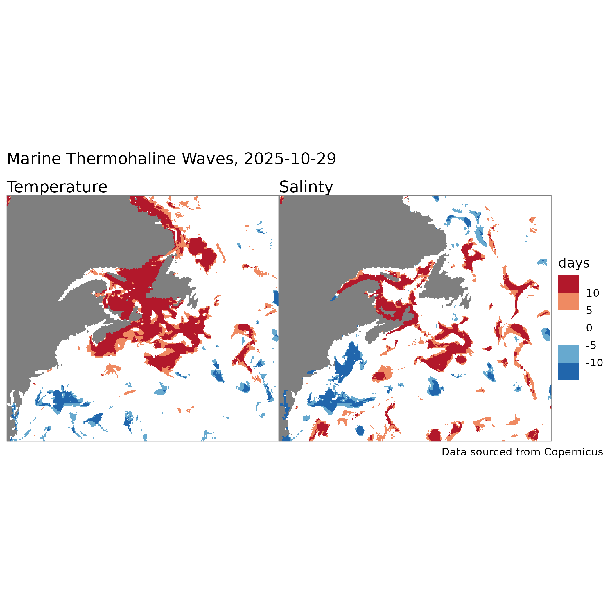

```{r setup, include=FALSE}
knitr::opts_chunk$set(echo = TRUE)
```

[Hobday et al (2016)](https://www.sciencedirect.com/science/article/abs/pii/S0079661116000057) proposed a framework for identify marine thermal waves (mtw).  Although the authors focused on marine heat waves, the framework applies to cold waves equally well as well as to other metrics such as salinity. [Hobday et al (2018)](https://tos.org/oceanography/article/categorizing-and-naming-marine-heatwaves) followed up with an additional framework for categorizing the severity of heat waves.  [Huang et al (2024)](https://agupubs.onlinelibrary.wiley.com/doi/10.1029/2024GL108369) deployed a similar framework for study of recent conditions.



Here we replicate Hobday's first framework using  [Copernicus Global Ocean Physics Reanalysis data](https://data.marine.copernicus.eu/product/GLOBAL_MULTIYEAR_PHY_001_030/description) and [Copernicus Global Ocean Physics Analysis and Forecast data](https://data.marine.copernicus.eu/product/GLOBAL_ANALYSISFORECAST_PHY_001_024/description) to develop a daily forecast (and hindcast) map for the region covering Cape Hatteras in North Carolina to Newfoundland including the Flemish Cap. 

In a nutshell, conditions that identify a heat/cold* wave are...

  + daily values exceed the 90th percentile of values for the day of year measured over a 30 year benchmark period, or
  
  + daily values fall below the 10th percentile of values for the day of year measured over a 30 year benchmark period, and 
  
  + the event persists for 5 or more days**.
  
```
* Of course we speak of heat/cold for temperature, but we could substitue high/low for salinity or other metrics as needed.

** There is some allowance to merge heat/cold waves that are interrupted by up to 2 days.
```

We count the number of contiguous days above/below the 90th/10th percentile. The map above shows these days where the deeper the colors the longer the duration of the extreme thermal event. It is important to note that these show the pixels that are exceed or fall below the 90th (red) or 10th (blue) percentile for extended periods of time.
